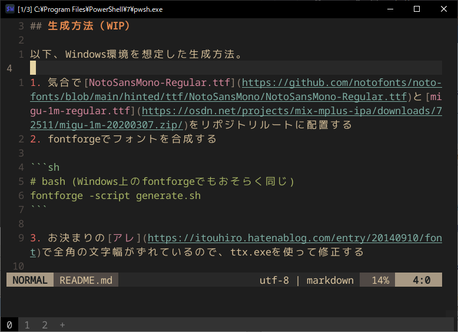

## 生成方法（WIP）

以下、Windows環境を想定した生成方法。

1. 気合で[NotoSansMono-Regular.ttf](https://github.com/notofonts/noto-fonts/blob/main/hinted/ttf/NotoSansMono/NotoSansMono-Regular.ttf)と[migu-1m-regular.ttf](https://osdn.net/projects/mix-mplus-ipa/downloads/72511/migu-1m-20200307.zip/)をリポジトリルートに配置する
2. fontforgeでフォントを合成する

```sh
# bash (Windows上のfontforgeでもおそらく同じ)
fontforge -script generate.sh
```

3. お決まりの[アレ](https://itouhiro.hatenablog.com/entry/20140910/font)で全角の文字幅がずれているので、ttx.exeを使って修正する

```powershell
.\ttx.exe -t OS/2 .\NotoSansMono1M-Regular.ttf
```

生成されたNotoSansMono1M-Regular.ttxの `xAvgCharWidth` を500にする。

```diff
<?xml version="1.0" encoding="utf-8"?>
<ttFont sfntVersion="\x00\x01\x00\x00" ttLibVersion="2.4">

  <OS_2>
    <version value="1"/>
-    <xAvgCharWidth value="600"/>
+    <xAvgCharWidth value="500"/>
    <usWeightClass value="400"/>
    <usWidthClass value="5"/>
    <fsType value="00000000 00000000"/>

```

修正したttxを生成済のフォントに適用する。

```powershell
Rename-Item -Path .\NotoSansMono1M-Regular.ttf -NewName .\NotoSansMono1M-Regular-pre.ttf
.\ttx.exe -m .\NotoSansMono1M-Regular-pre.ttf .\NotoSansMono1M-Regular.ttx
```

4. `NotoSansMono1M-Regular.ttf` をインストールして終了

## リンク

- <https://fonts.google.com/noto/specimen/Noto+Sans+Mono>
- <https://mix-mplus-ipa.osdn.jp/migu/>
- <https://rtfreesoft.blogspot.com/search/label/ttx>
